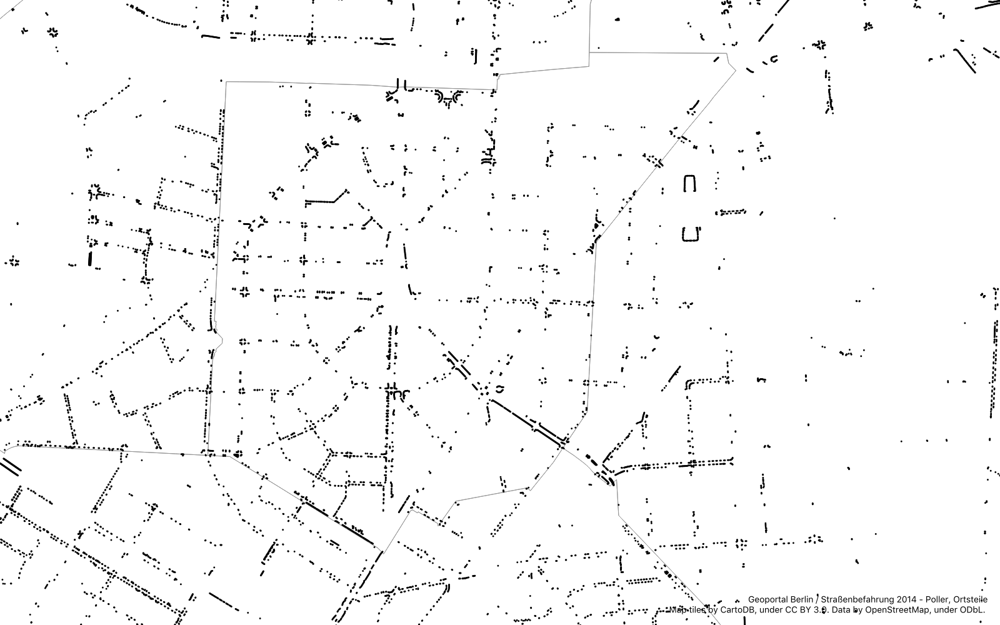

# berlin-bollards

In diesem Repository befinden sie die Daten und Konfigurationen, um mit QGIS alle Poller Berlins auf einer Karte darzustellen und Auswertungen vorzunehmen.

### Auswertungen

Insgesamt besteht der Datensatz aus 344.667 Pollern. Pro ha Fläche stehen also in Berlin durchschnittlich 3,9 Poller. 

Teilt man die gesamte Stadt in Quadrate von 50 x 50 m auf, steht also auf jedem dieser Quadrate ein Poller.

Auf einen Poller kommen ca. 10 Einwohner und ca. 4 zugelassene Kraftfahrzeuge.

#### Als Protected Bike Lane

Bei einer Umsetzung von geschützten Radverkehrsanlagen (Protected Bike Lane) mit einem Abstand der Poller von 2 m entspräche die Gesamtzahl der Berliner Poller einer Protected Bike Lane mit ca. 700 km Länge und somit ca. 20 % der Hauptverkehrsstraßen.

#### Ortsteile

Bei den Ortsteilen ist der Spitzenreiter Friedenau mit 22,8 Pollern pro ha, gefolgt von Halensee (19,6/ha) und Alt-Treptow (18,7/ha).

## Bezirke

Der Bezirk mit der höchsten Pollerdichte ist Friedrichshain-Kreuzberg mit 13,6/ha. An zweiter Position steht Mitte mit 10,3/ha und an dritter Stelle Tempelhof-Schöneberg mit 6,4/ha. An letzter Stelle steht Spandau mit 1,1/ha.

Bezogen auf die Einwohnerzahlen ergibt sich ein anderes Bild. Treptow-Köpenick führt mit 160 Pollern pro 1000 Einwohner, gefolgt von Steglitz-Zehlendorf mit 131 und Charlottenburg-Wilmersdorf mit 119. Das Schlusslicht bildet auch hier Spandau mit 44 Pollern pro 1000 Einwohner.

### Daten

Unter https://daten.berlin.de/datensaetze/straßenbefahrung-2014-poller-wfs-0 stellt das Land Berlin die Geodaten aller bei der Straßenbefahrung 2014 erfassten Poller zur Verfügung. Zusätzlich werden die [Ortsteile von Berlin](https://daten.berlin.de/datensaetze/ortsteile-von-berlin-wms) zur Analyse und für die verwendet

Die Daten für die Poller sind mit ogr2ogr ([GDAL](https://www.gdal.org/index.html)) am 16.04.2019 vom FIS-Broker heruntergeladen und konvertiert worden.

### Voraussetzungen:
* Unterstützung für [Git-LFS](https://git-lfs.github.com)
* [QGIS 3](https://www.qgis.org/en/site/) 